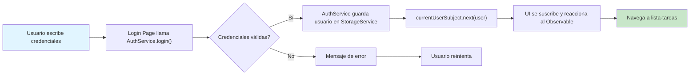
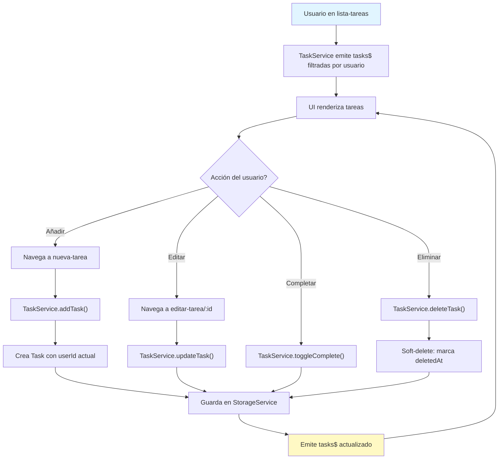
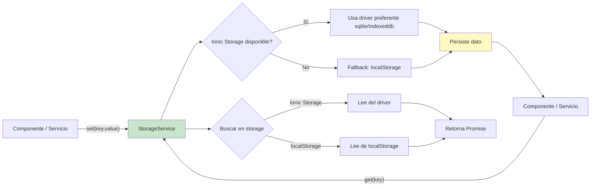
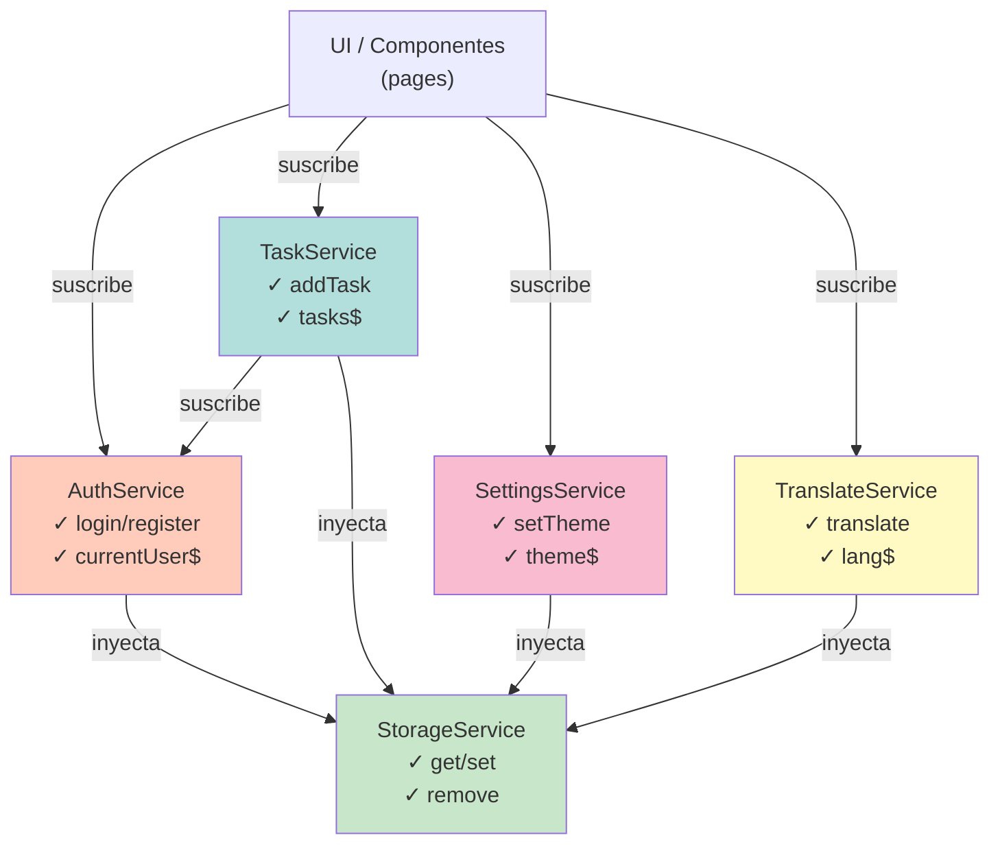
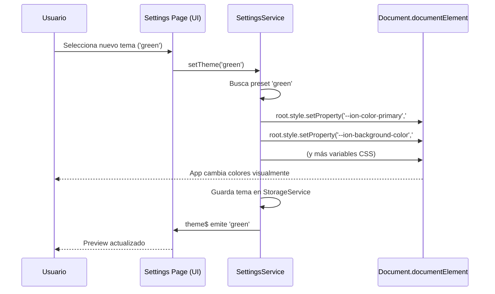
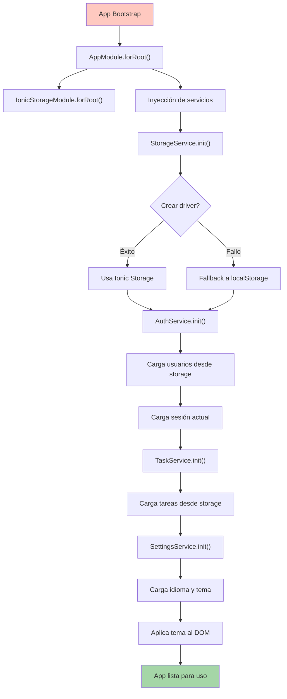

# Arquitectura de Mi Recordatorio

Documento de diseño y arquitectura del proyectto **Mi Recordatorio**, incluye diagramas de flujos, relaciones de servicios y patrones implementados.

## Resumen de capas

El proyecto sigue una arquitectura basada en capas con patrones reactivos (RxJS):

```
┌─────────────────────────────────────────────────────────────┐
│                    CAPA PRESENTACIÓN (UI)                   │
│  Componentes Angular + Ionic (páginas, formularios, vistas)  │
└────────────────────────┬────────────────────────────────────┘
                         │
┌────────────────────────▼────────────────────────────────────┐
│                   CAPA SERVICIOS (Lógica)                    │
│  AuthService, TaskService, SettingsService, StorageService  │
└────────────────────────┬────────────────────────────────────┘
                         │
┌────────────────────────▼────────────────────────────────────┐
│                CAPA PERSISTENCIA (Storage)                   │
│  @ionic/storage-angular (SQLite/IndexedDB/localStorage)      │
└─────────────────────────────────────────────────────────────┘
```

## Flujo de Autenticación



Detalles del flujo de login:

1. **Usuario ingresa credenciales** en `LoginPage`.
2. **Llamada a `AuthService.login(username, password)`** que retorna un `Observable<boolean>`.
3. **AuthService busca** en el array `users` que coincida username y password.
4. Si encuentra, llama a **`saveCurrentUser(user)`**:
   - Guarda en `StorageService.set(CURRENT_USER_KEY, user)`
   - Emite `currentUserSubject.next(user)` para notificar suscriptores
5. **TaskService se suscribe** a `AuthService.currentUser$` y actualiza su lista de tareas.
6. **LoginPage recibe el evento** y navega a `/lista-tareas`.

## Flujo de Gestión de Tareas



Detalle: cuando se añade una tarea:

1. **`TaskService.addTask(taskData)`** recibe los datos sin ID.
2. Genera un nuevo `Task` con:
   - `id`: generado secuencialmente
   - `userId`: del usuario actual (`authService.getCurrentUser().id`)
   - `createdAt` / `updatedAt`: timestamps ISO
3. Empuja a `this.tasks` y llama **`addToHistory(..)`** para registrar la acción.
4. Llama a **`saveToStorage()`** (asincrónica) que persiste en `StorageService`.
5. Emite `tasksSubject.next(filteredTasks)` para actualizar la UI.

## Flujo de Persistencia (Storage)



El `StorageService` actúa como intermediario:

- **Inicialización**: en el constructor llama `this.init()` que intenta crear el driver de Ionic Storage.
- **Si falla** (por compatibilidad u otros), activa `useLocalStorageFallback = true`.
- **`get(key)`** y **`set(key,value)`**: retornan `Promise`, escalables para drivers síncronos y asincronos.
- **Ventaja**: código agnóstico sobre el driver subyacente.

## Diagrama de relaciones entre servicios



Relaciones clave:

- **AuthService**: responsable de usuarios y sesión; expone `currentUser$`.
- **TaskService**: inyecta `AuthService` para filtrar tareas del usuario actual; se suscribe a `currentUser$`.
- **SettingsService**: inyecta `StorageService` para persistir idioma y tema.
- **TranslateService**: similar, almacena idioma.
- **Todos dependen de StorageService**: punto único de abstracción de persistencia.

## Cambio de tema (Theming)



Proceso detallado de cambio de tema:

1. **Usuario selecciona tema en `SettingsPage`** via `<ion-select>`.
2. **Evento `ionChange`** llama a `SettingsService.setTheme(themeName)`.
3. **SettingsService.applyTheme()** recibe el nombre del tema:
   - Busca en el diccionario `presets` la configuración (colores primario, fondo, etc.)
   - Modifica `document.documentElement.style.setProperty(variableName, value)` para cada variable CSS
4. **Los cambios CSS se reflejan inmediatamente** en la UI (sincronos).
5. **Persistencia**: guarda en `StorageService.set('app_theme', themeName)`.
6. **Observable**: emite `themeSubject.next(themeName)` para que cualquier suscriptor reaccione.

Variables CSS modificadas (ver [src/global.scss](../src/global.scss)):

- `--ion-color-primary`: color principal
- `--ion-background-color`: fondo general
- `--ion-text-color`: color de texto
- `--ion-item-background`: fondo de items
- `--ion-card-background`: fondo de tarjetas
- `--ion-color-success`: color de éxito

## Patrones implementados

### 1. Reactive (Observable / BehaviorSubject)

Todos los servicios principales exponen observables públicos:

```typescript
// AuthService
public currentUser$ = this.currentUserSubject.asObservable();

// TaskService
public tasks$ = this.tasksSubject.asObservable();
public deletedTasks$ = this.deletedTasksSubject.asObservable();

// SettingsService
public language$ = this.languageSubject.asObservable();
public theme$ = this.themeSubject.asObservable();
```

Los componentes se suscriben y reaccionan automáticamente a cambios sin imperativos. Ejemplo:

```typescript
constructor(private taskService: TaskService) {
  this.taskService.tasks$.subscribe(tasks => {
    this.taskList = tasks;  // UI actualiza automáticamente
  });
}
```

### 2. Inyección de dependencias (Angular DI)

Servicios proveedores en `AppModule`:

```typescript
@Injectable({ providedIn: 'root' })
export class AuthService { }
```

El `providedIn: 'root'` registra el servicio globalmente, evitando la necesidad de declararlo en `@NgModule` y favoreciendo lazy-loading.

### 3. Soft-delete (Papelera)

En lugar de borrar tareas, se marca con `deletedAt`:

```typescript
deleteTask(id: number) {
  const task = this.tasks.find(t => t.id === id);
  if (task) {
    task.deletedAt = new Date().toISOString();  // marca eliminada
    // registra en historial
    // guarda en storage
  }
}
```

Ventajas: recuperación sin pérdida, auditoría, soft-delete reversible.

### 4. Historial de acciones

Cada cambio a una tarea genera una entrada en `TaskHistory`:

```typescript
interface TaskHistory {
  id: number;
  taskId: number;
  userId: number;
  action: 'created' | 'updated' | 'completed' | 'deleted' | 'restored';
  oldValue: any;
  newValue: any;
  timestamp: string;
}
```

Permite auditoría y trazabilidad completa.

### 5. Filtrado por usuario autenticado

`TaskService` filtra tareas en tiempo real basándose en usuario actual:

```typescript
private updateTasksSubject(): void {
  const currentUser = this.authService.getCurrentUser();
  if (currentUser) {
    const userTasks = this.tasks.filter(task => 
      task.userId === currentUser.id && !task.deletedAt
    );
    this.tasksSubject.next(userTasks);  // emite filtradas
  }
}
```

Cada usuario ve solo sus tareas.

## Ciclo de vida de inicialización



Orden de inicialización (importante para evitar race conditions):

1. **AppModule**: registra todos los servicios y pone `IonicStorageModule.forRoot()`.
2. **StorageService**: inicializa driver. Sin esperar explícitamente.
3. **AuthService**: llama a `init()` que carga usuarios y sesión (promesas internas).
4. **TaskService**: se suscribe a `currentUser$` de `AuthService` para reaccionar.
5. **SettingsService**: carga idioma/tema y aplica al DOM.

La inicialización es mayormente asincrónica (Promises), pero no bloquea la UI (ya que ocurre en constructor).

## Mejoras arquitectónicas sugeridas

1. **Backend real**: mover `AuthService` a RESTful + JWT tokens.
2. **Caché inteligente**: implementar estrategia de caché (offline-first sync).
3. **NGRX o Akita**: para estado más complejo (actualmente BehaviorSubject es suficiente).
4. **API typing**: generar interfaces desde OpenAPI si hay backend.
5. **Tests**: agregar unit tests para `AuthService`, `TaskService`, `StorageService`.

---

## Referencias de diagramas

Todos los diagramas están generados con **Mermaid.js**. Para editar/regenerar:

- Cambiar sintaxis en este archivo y abrir en cualquier visor de Mermaid.
- O copiar código mermaid a https://mermaid.live/ para vista interactiva.
